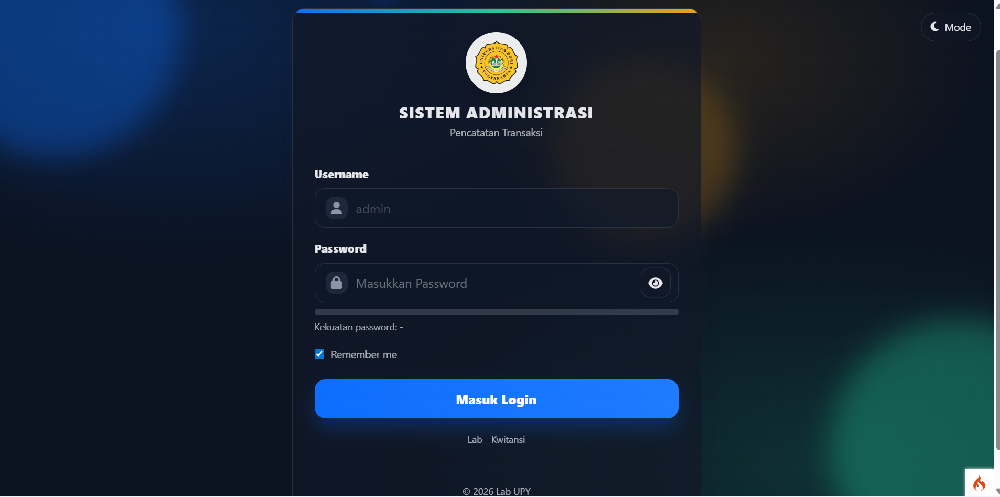
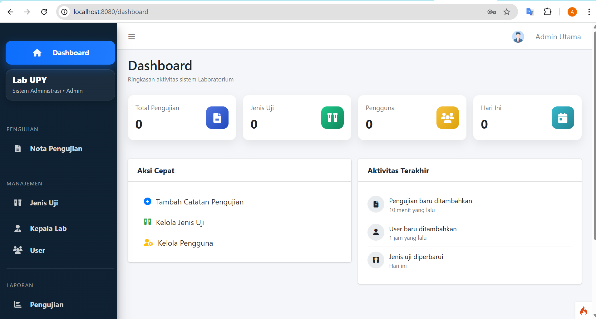
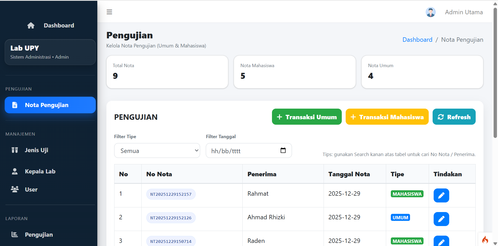
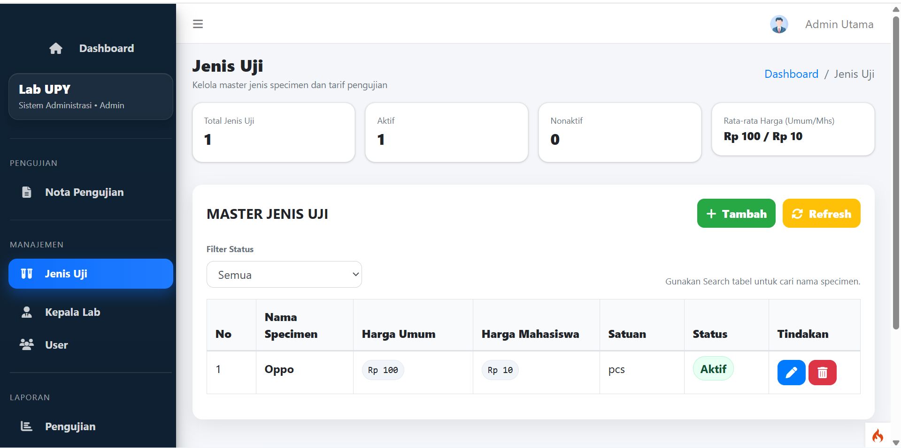
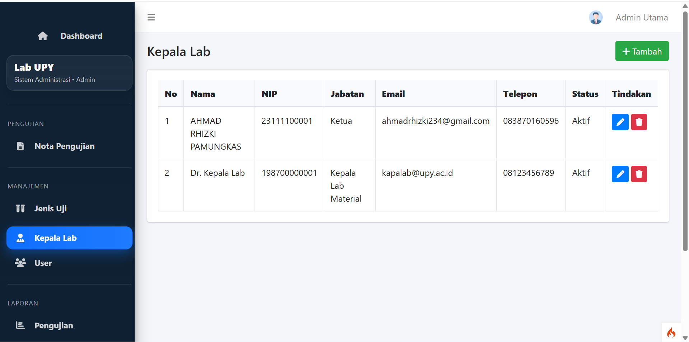
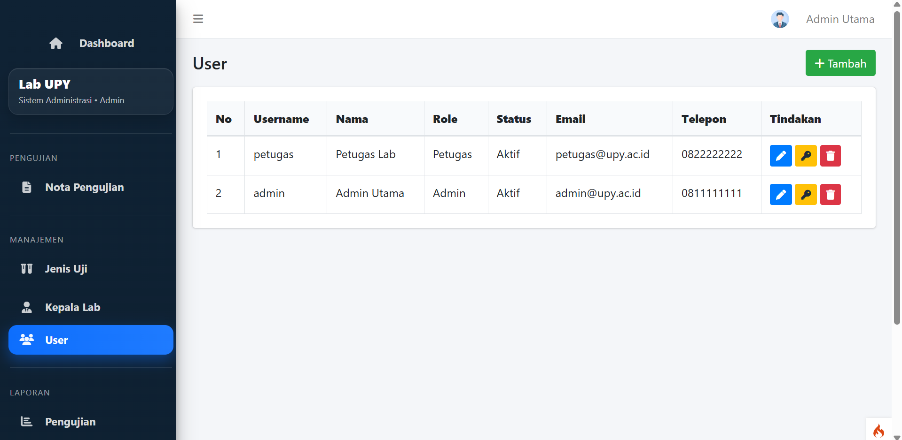
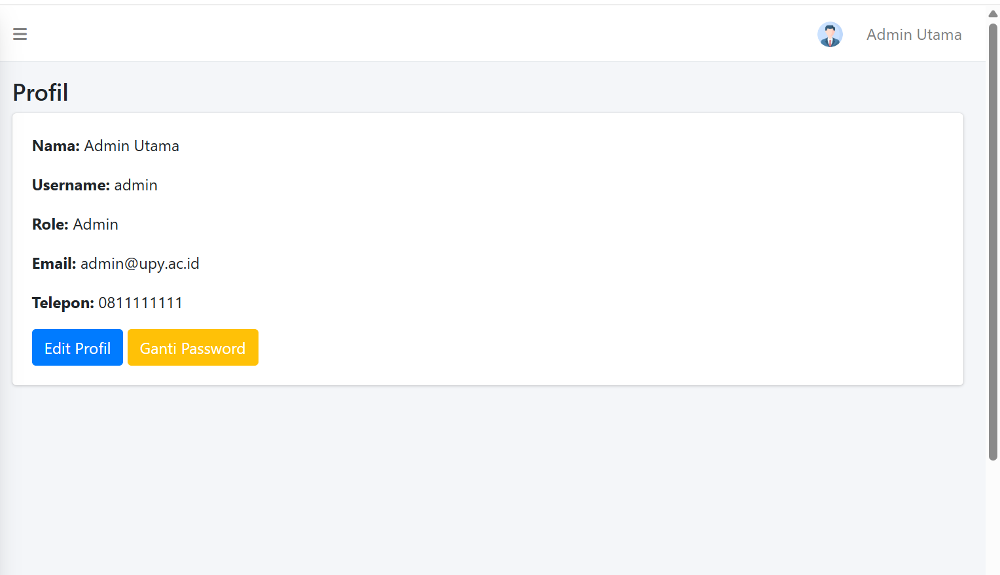
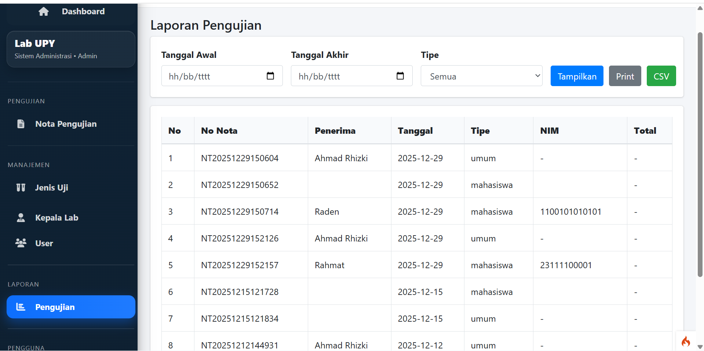

Sistem Administrasi Lab UPY (CodeIgniter 4)

Aplikasi web berbasis CodeIgniter 4 (MVC) untuk membantu administrasi laboratorium dalam pencatatan transaksi/pengujian, pengelolaan master data, serta pembuatan laporan.

Fitur Utama

Authentication

Login

Remember Me

Dashboard

Ringkasan aktivitas

Statistik pengujian

Manajemen Nota Pengujian

Tambah / Edit / Hapus data

Filter berdasarkan tipe

Filter tanggal pengujian

Tipe pengujian: Umum & Mahasiswa

Master Jenis Uji

CRUD jenis specimen

Tarif umum & mahasiswa

Status aktif / nonaktif

Manajemen Pengguna

CRUD user

Role: Admin / Petugas

Reset password

Ganti password

Manajemen Kepala Lab

CRUD data kepala laboratorium

Laporan Pengujian

Filter berdasarkan tanggal

Filter tipe pengujian

Export laporan:

Print

CSV

> Project ini dibuat untuk mempermudah administrasi lab dalam pencatatan transaksi/pengujian, pengelolaan master data, serta pembuatan laporan yang dapat diekspor (CSV/Print).

Tech Stack

Backend

PHP

CodeIgniter 4 (MVC Framework)

Database

MySQL / MariaDB

Frontend

HTML

CSS

JavaScript

Admin Dashboard UI

Struktur Project
CI-4
│
├── app/
│   ├── Controllers/
│   ├── Models/
│   └── Views/
│
├── public/
├── system/
├── writable/
│
├── spark
├── composer.json
└── README.md

Penjelasan:

Controllers → logic aplikasi (Auth, Dashboard, Nota, Laporan, dll)

Models → akses database

Views → tampilan UI

public/ → entry point aplikasi + aset CSS/JS

Cara Menjalankan Project
1 Requirements

Pastikan sudah terinstall:

PHP ≥ 7.4 (disarankan PHP 8.x)

Composer

MySQL / MariaDB

2 Install Dependency
composer install
3 Setup Environment

Salin file environment:

cp env .env

Edit file .env:

CI_ENVIRONMENT = development

Konfigurasi database:

database.default.hostname = localhost
database.default.database = nama_database
database.default.username = root
database.default.password =
database.default.DBDriver = MySQLi
4 Import Database

Import file SQL yang tersedia di repository:

uas_pbd_lab (1).sql

Contoh via CLI:

mysql -u root -p nama_database < "uas_pbd_lab (1).sql"
5 Jalankan Server
php spark serve

Buka di browser:

http://localhost:8080
Akun Demo (Opsional)

Jika database yang diimport sudah berisi user:

Admin

Username : admin
Password : admin

Jika belum tersedia, buat user manual melalui database.

Modul Sistem

Nota Pengujian

pencatatan transaksi pengujian

tipe umum / mahasiswa

filter data

Jenis Uji

master data tarif pengujian

status aktif / nonaktif

User & Kepala Lab

manajemen akun pengguna

manajemen data kepala laboratorium

Laporan

rekap pengujian

export Print / CSV

## Demo
Saat ini belum ada versi live hosting.

Untuk melihat tampilan dan alur aplikasi tanpa instalasi, silakan cek bagian **Screenshots** di bawah.
(Opsional) Demo Video: _tambahkan link setelah upload_.

## Screenshots
| Login | Dashboard |
|---|---|
|  |  |

| Nota Pengujian | Master Jenis Uji |
|---|---|
|  |  |

| Kepala Lab | Manajemen User |
|---|---|
|  |  |

| Profil | Laporan Pengujian |
|---|---|
|  |  |

## Alur Penggunaan (Singkat)
1. Login sebagai **Admin/Petugas**
2. Kelola **Nota Pengujian** (Umum/Mahasiswa)
3. Kelola master data (**Jenis Uji**, **Kepala Lab**, **User**)
4. Generate **Laporan Pengujian** dengan filter tanggal/tipe, lalu export **Print/CSV**

## Akun Demo (Local)
Akun demo mengikuti data user pada file database `.sql` yang diimport.
Silakan cek tabel `users` setelah import untuk kredensial login.

Lisensi

Project ini menggunakan MIT License
lihat file LICENSE.

Author

Ahmad Rhizki Pamungkas

GitHub
https://github.com/rhizki-cloud
